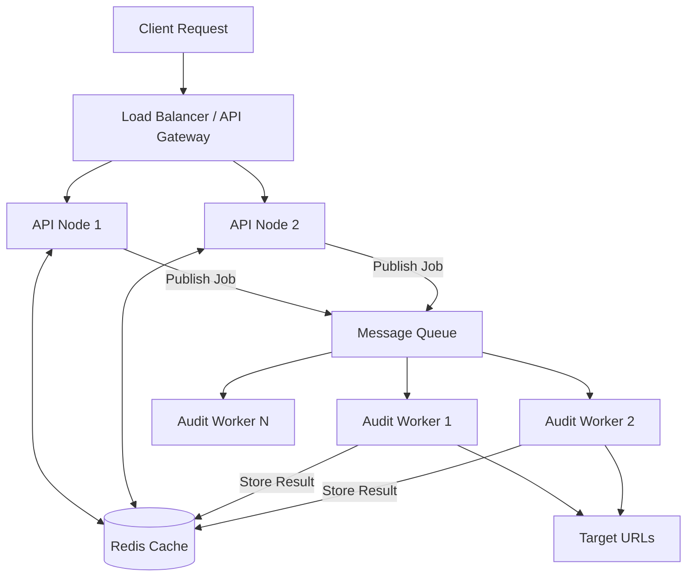

# Architecture Document: Scaling to 10,000 Audits/Day (Task B)

## 1. System Architecture & Diagram

To reliably process 10,000 audits per day and smoothly handle traffic bursts of 500 concurrent requests without violating customer SLAs, we must transition from a synchronous monolith to an asynchronous, decoupled event-driven architecture.

**Data Flow & State Location:**
1. **Client requests** an audit. The Load Balancer routes to an available API Node.
2. **API Node** checks **Redis (where state lives)**. If the URL is cached, it returns instantly.
3. If not cached, the API Node pushes an audit job to the **Message Queue** and immediately returns a `job_id` to the client (HTTP 202 Accepted).
4. **Audit Workers** independently pull jobs from the queue at a controlled concurrency rate, perform the audit, and save the result to Redis.
5. **Client** polls the API with the `job_id` (or receives a webhook) to get the final result.

**Queueing Strategy (Handling the 500 burst):**
By returning a `job_id` instantly, the API never blocks. If 500 requests hit simultaneously, 500 messages are durably stored in the queue in milliseconds. The workers pull from the queue at a steady pace (e.g., 50 concurrent outbound requests) protecting both our infrastructure and the target servers from being overwhelmed.

## 2. Technology Decision Record (ADR)

* **Runtime: Node.js vs Python/Go**
  * *Choice:* Node.js.
  * *Justification:* URL auditing involves heavy I/O (network requests). Node.js's non-blocking event loop is inherently designed to handle thousands of concurrent I/O operations with low memory overhead.
* **Cache: Redis vs Memcached**
  * *Choice:* Redis.
  * *Justification:* We need persistence and advanced data structures. Redis supports pub/sub (useful if we want to stream real-time updates back to the API nodes) and disk persistence, which Memcached lacks.
* **Message Queue: RabbitMQ (or AWS SQS) vs Kafka**
  * *Choice:* RabbitMQ / SQS.
  * *Justification:* URL audits are transient tasks that need to be processed once and then deleted. We don't need the heavy event-streaming and log-replay capabilities of Kafka. SQS/RabbitMQ are perfect for simple task delegation and worker load-balancing.

## 3. Failure Mode Analysis

The top three most likely failure modes at this scale:

1. **Target Server Blocking / Rate Limiting (IP Bans)**
   * **Failure:** Auditing the same domain repeatedly causes the target to block our IP (HTTP 429 or connection drops).
   * **Mitigation:** Implement aggressive internal caching (Redis) so we never hit the same URL twice in a short window. Use a proxy rotation service for outgoing worker requests to distribute the origin IPs.
2. **Message Queue Backup (Worker Exhaustion)**
   * **Failure:** A massive burst of requests outpaces the workers, causing the queue to grow indefinitely and breaking SLA times.
   * **Mitigation:** Configure Auto-Scaling Groups (ASG/KEDA) for the worker nodes. If queue depth > 100, automatically spin up additional worker containers to process the backlog, then spin them down when the queue empties.
3. **Redis Out Of Memory (OOM)**
   * **Failure:** Caching thousands of large HTML audit results consumes all Redis memory, causing the cache to crash or evict important keys.
   * **Mitigation:** Configure a strict TTL (Time to Live) on all cache entries. Configure Redis maxmemory-policy to `allkeys-lru` (Least Recently Used) so it gracefully drops old audits rather than crashing.

## 4. Observability and Rollback Plan

**Monitoring & Alerting:**
* **Metrics:** Use Prometheus to track `queue_depth`, `api_latency_p95`, `error_rate_5xx`, and `cache_hit_ratio`.
* **Alerts:** Use PagerDuty to page the on-call engineer if:
  * Error rate exceeds 5% for > 5 minutes.
  * Queue depth exceeds 1,000 (indicating workers are stuck).
* **Logging:** All logs contain a unique `X-Request-ID` injected at the API gateway, allowing full traceability of a single audit from the API node down to the specific worker node using an ELK stack or Datadog.

**Rollback Plan (Bad Deploy):**
* We use immutable Docker images tagged with Git commit hashes.
* We utilize **Canary Deployments** via Kubernetes. A new version receives only 5% of traffic initially.
* If Prometheus detects an elevated 5xx error rate or latency spike in the canary pods, the deployment is automatically aborted, and the orchestrator routes 100% of traffic back to the previous stable Docker image within seconds.
